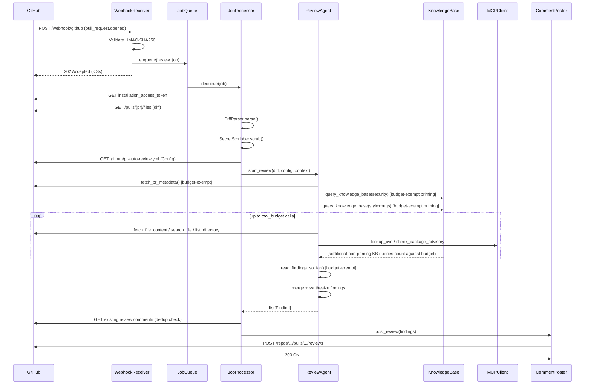
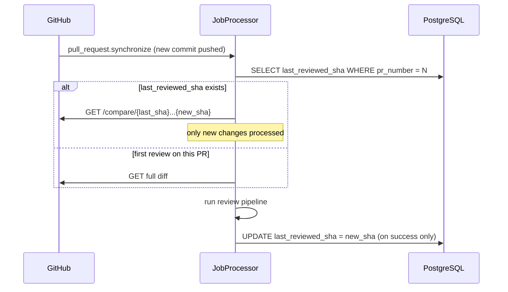
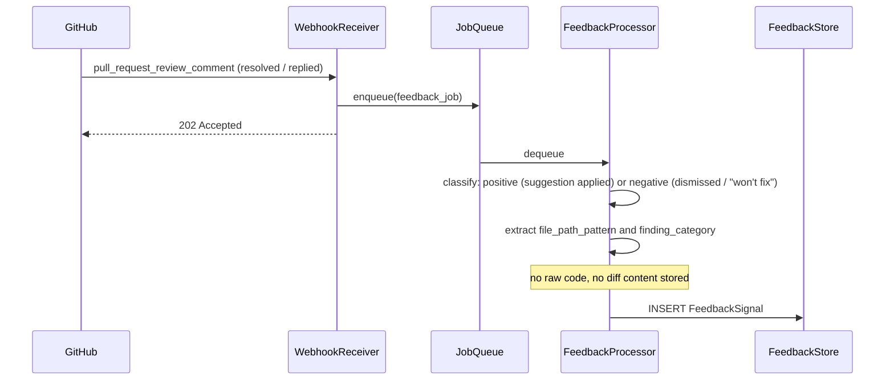
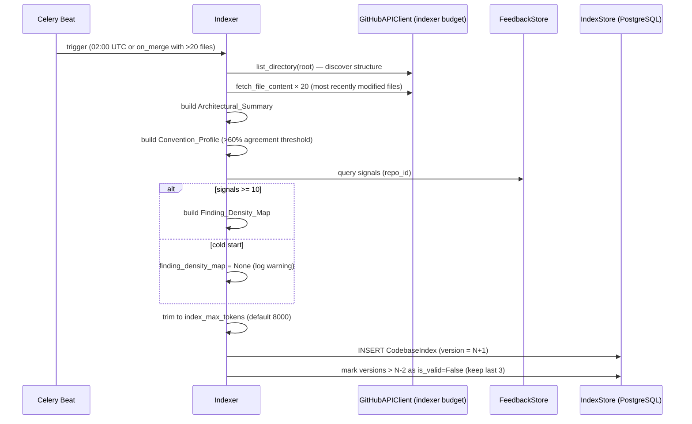

# Design Document: GitHub PR Auto-Review

> Covers v1 (Req 1–11) and v2 (Req 12–17). v2 sections are marked **[v2]**. Read requirements.md and requirements-v2.md as the authoritative source of acceptance criteria. This document resolves architecture decisions and all flagged design constraints.

---

## 1. Architecture Decision: Modular Monolith

**Decision:** Deploy as a single FastAPI application with Celery workers, not as microservices.

**Rationale:**
- Single team, early stage — microservice overhead (network contracts, independent deploys, distributed tracing setup) delivers no value yet
- All components share the same GitHub App credentials, Config loader, and database — extracting them adds round-trips with no benefit
- The Job_Queue already provides the key async decoupling the spec requires (Req 8)
- The Indexer [v2] is the only candidate for extraction — it has genuinely different scaling and scheduling needs. It runs as a separate Celery queue on the same worker fleet, which is sufficient isolation without a separate service

**Extraction triggers (not now):** extract Indexer to a separate service when it creates measurable API quota contention with review jobs in production. Extract Knowledge_Base to a separate service only if retrieval latency exceeds 500ms p99 under real load.

---

## 2. System Architecture

```
                        ┌─────────────────────────────────┐
                        │             GitHub               │
                        │  (webhooks, REST API, Reviews)   │
                        └────┬──────────────────────┬──────┘
                             │ webhook               │ API calls
                    ┌────────▼────────┐              │
                    │ WebhookReceiver │              │
                    │  (FastAPI)      │              │
                    │  HMAC validate  │              │
                    │  ack < 3s       │              │
                    └────────┬────────┘              │
                             │ enqueue               │
                    ┌────────▼────────┐              │
                    │   JobQueue      │              │
                    │   (Redis)       │              │
                    │  review_jobs    │              │
                    │  indexer_jobs   │              │
                    └────────┬────────┘              │
                             │ dequeue               │
                    ┌────────▼──────────────────────▼──────┐
                    │          Celery Workers               │
                    │                                       │
                    │  ┌─────────────┐  ┌───────────────┐  │
                    │  │ JobProcessor│  │ FeedbackProc  │  │
                    │  │             │  │               │  │
                    │  │ DiffParser  │  │ SignalClassify │  │
                    │  │ SecretScrub │  │ FeedbackStore │  │
                    │  │ ConfigLoad  │  └───────────────┘  │
                    │  │ ReviewAgent │                      │
                    │  │ CommentPost │  ┌───────────────┐  │
                    │  └─────────────┘  │ Indexer [v2]  │  │
                    │                   │ (Celery Beat) │  │
                    │                   └───────────────┘  │
                    └───────────────────────────────────────┘
                             │
          ┌──────────────────┼──────────────────┐
          │                  │                  │
   ┌──────▼──────┐   ┌───────▼───────┐   ┌─────▼──────┐
   │ PostgreSQL  │   │   ChromaDB    │   │   Redis    │
   │             │   │               │   │            │
   │ jobs        │   │ org_guidelines│   │ job queue  │
   │ feedback    │   │ lang_practices│   │ rate limit │
   │ findings    │   │ cve_snapshot  │   │ token cache│
   │ index [v2]  │   │ fix_kb        │   └────────────┘
   └─────────────┘   │ lessons_learn │
                     │ cross_repo[v2]│
                     └───────────────┘

   ┌─────────────────────────────────────────────┐
   │  Evaluation Harness (separate package)       │
   │  Inspect AI tasks, LiteLLM judges            │
   │  No runtime dependency on PR_Reviewer        │
   └─────────────────────────────────────────────┘
```

---

## 3. Component Responsibilities

### 3.1 WebhookReceiver

- FastAPI router at `POST /webhook/github`
- Validates `X-Hub-Signature-256` HMAC-SHA256 against webhook secret — rejects 401 on mismatch
- Reads `X-GitHub-Event` header to route: `pull_request` events → `review_jobs` queue; `pull_request_review_comment` events → `feedback_queue`
- Enqueues and returns `202 Accepted` within 3 seconds (Req 1 AC4)
- Checks draft state from payload before enqueuing (Req 1 AC14) — skip if draft and `review_draft_prs: false`

### 3.2 JobQueue

- Redis-backed Celery with three named queues and explicit priorities:
  - `review_jobs` (priority 9) — PR review tasks
  - `feedback_jobs` (priority 5) — feedback signal recording
  - `indexer_jobs` (priority 1) — scheduled Indexer runs [v2]
- Dead letter: Celery's `task_acks_late + max_retries=3` pattern; on exhaustion, job state set to `dead_letter` and a failure comment is posted (Req 1 AC13)

### 3.3 JobProcessor

Orchestrates the review pipeline for a dequeued job:

1. Fetch GitHub App Installation_Access_Token (refresh if within 5 min of expiry, Req 1 AC11)
2. Dedup check: fetch existing bot reviews for this commit SHA (Req 1 AC6/AC7)
3. Fetch raw diff via GitHub API
4. `DiffParser.parse(raw_diff, config)` → `StructuredDiff`
5. `SecretScrubber.scrub(diff_content)` → `(scrubbed_diff, detections)`
6. `ConfigLoader.load(repo)` → `Config`
7. Inject Codebase_Index if enabled [v2]
8. `ReviewAgent.run(structured_diff, config, context)` → `list[Finding]`
9. Fetch existing comments for dedup (Req 5 AC10)
10. `CommentPoster.post(findings, pr)` → GitHub review

### 3.4 DiffParser

- Stateless, pure Python
- Parses unified diff format into `StructuredDiff`
- Preserves GitHub pull request line position index per changed line (Req 2 AC2)
- Applies ignore patterns from Config (Req 2 AC3/AC4)
- Truncates at 3,000 changed lines with truncation notice (Req 2 AC7)
- Skips binary files and records them in `skipped_files` (Req 2 AC6)

### 3.5 SecretScrubber

- Uses `detect-secrets` library with all plugin detectors enabled
- Input: raw string content; output: `(scrubbed: str, detections: list[Detection])`
- Never mutates the input string — returns a new string (immutability)
- Called on: diff content before LLM submission, fetched file content, Knowledge_Base retrieved entries
- If triggered on Knowledge_Base content: logs at ERROR level with `corpus` and `entry_id` (Req 11 AC7 — indicates upstream Req 9 AC7 violation)

### 3.6 ReviewAgent

- LangChain agent with OpenAI GPT-4o as default provider (Req 3 AC1)
- Provider-pluggable via LangChain's `BaseChatModel` interface
- `ToolBudgetMiddleware` wraps each tool call: increments counter, raises `BudgetExhaustedError` at limit
- Budget-exempt tools bypass the counter (see §4.2)
- On `BudgetExhaustedError` mid-security-verification: emits Escalation comment instead of discarding (Req 3 AC10)
- On LLM timeout (30s): retries once with 1s delay; on second failure, finalizes partial Findings and proceeds (Req 3 AC12)

### 3.7 CommentPoster

- Formats `list[Finding]` into GitHub Reviews API payload
- Determines review status from Finding severities (Req 5 AC3–AC7)
- Deduplicates against existing comments before constructing payload (Req 5 AC10)
- On 422 from GitHub API: logs invalid line reference, skips that comment, continues (Req 5 AC8)
- Constructs summary body: "Found N issue(s) across M category/categories." (Req 5 AC9)

### 3.8 ConfigLoader

- Fetches `.github/pr-auto-review.yml` from target repo via GitHub API
- Validates with Pydantic schema; on validation error: logs warning, returns defaults (Req 7 AC5)
- Returns `Config` dataclass (frozen/immutable)

### 3.9 GitHubAPIClient

- Manages JWT → Installation_Access_Token exchange (Req 1 AC1)
- Token cache: stores token + expiry in Redis; proactively refreshes within 5 minutes of expiry
- Retry logic: on rate limit (403/429), reads `Retry-After` header, sleeps, retries up to 3 times (Req 1 AC10)
- Separate `GitHubAPIClient` instance for Indexer with its own rate limit token bucket [v2]

### 3.10 KnowledgeBase

- ChromaDB as vector store, running in-process (embedded mode for v1; server mode for multi-worker deployments)
- Embedding model: `text-embedding-3-small` (OpenAI) — pinned; model version stored in every entry
- Five collections in v1: `org_guidelines`, `language_best_practices`, `cve_snapshot`, `fix_knowledge_base`, `lessons_learned`
- Additional collection in v2: `cross_repo_fixes`
- `query_knowledge_base` returns top-5 entries by cosine similarity, filtered by `category` and `language` tags
- Startup validation: checks all entries share the same `model_version`; refuses retrievals and logs ERROR if mismatch detected

### 3.11 MCPClient

- Thin HTTP client over MCP server protocol
- Per-server token bucket rate limiters (configurable; defaults: NVD 10 req/min, OSV 20 req/min)
- On rate limit exhaustion: falls back to `cve_snapshot` corpus; logs fallback event with server name
- Fallback chain: live MCP server → `cve_snapshot` corpus → Escalation comment noting unverified CVE data

### 3.12 FeedbackStore

- PostgreSQL-backed
- Records `FeedbackSignal` on comment resolution/reply/suggestion acceptance (Req 9 AC1–AC4)
- Never stores raw diff, code snippets, or Secret_Scrubber-redacted content (Req 9 AC7)
- `query_recent(repo_id, file_path_patterns, limit=5)` for few-shot context injection (Req 9 AC5)

### 3.13 Indexer [v2]

- Celery Beat task on `indexer_jobs` queue
- Default schedule: 02:00 UTC daily; additional trigger on `push` to default branch with >20 file changes
- Uses separate `GitHubAPIClient` instance with isolated rate limit budget (10 req/min)
- Samples the 20 most recently modified files (by commit history) to build `Convention_Profile`
- `Finding_Density_Map` is omitted if `FeedbackStore` has fewer than 10 signals for the repo (cold start)
- Stores versioned `CodebaseIndex` in PostgreSQL; retains last 3 versions; old versions marked `is_valid: False` but not deleted

### 3.14 Evaluation Harness

- Separate Python package in `eval/` directory; zero runtime imports from the main `pr_reviewer` package
- Inspect AI task suite: `inspect eval eval/tasks/` from CLI
- `inspect view` for per-sample trace and judge rationale browsing
- LiteLLM for all judge calls — judge model for security category must differ from GPT-4o (e.g., Claude Sonnet)
- Reads from stored `Finding` records in PostgreSQL, never from raw diff content (Req 10 AC10)

---

## 4. Data Models

All models are immutable (`frozen=True` dataclasses or Pydantic models with `model_config = ConfigDict(frozen=True)`).

### Job

```python
@dataclass(frozen=True)
class Job:
    id: UUID
    repo_id: str
    installation_id: int
    pr_number: int
    commit_sha: str
    last_reviewed_sha: str | None  # for incremental diff (Req 1 AC8)
    status: JobStatus              # queued | processing | complete | failed | dead_letter
    attempts: int
    created_at: datetime
    updated_at: datetime
    context_tokens_used: int | None  # tracked post-completion for budget monitoring
```

### Finding

```python
@dataclass(frozen=True)
class Finding:
    id: UUID
    job_id: UUID
    file_path: str
    line_number: int
    start_line: int | None   # multi-line suggestion only
    category: ReviewCategory # bugs | security | style | performance
    severity: Severity       # low | medium | high
    confidence: Confidence   # low | medium | high
    explanation: str
    suggestion: str | None   # None for low severity or invalid suggestion
    is_escalation: bool
    related_finding_ids: list[UUID]  # cross-category annotations (Req 3 AC14)
```

### FeedbackSignal

```python
@dataclass(frozen=True)
class FeedbackSignal:
    id: UUID
    repo_id: str
    finding_category: ReviewCategory
    file_path_pattern: str
    signal_type: SignalType  # positive | negative
    timestamp: datetime
    # no raw code, no diff content, no scrubber-redacted fields (Req 9 AC7)
```

### KnowledgeBaseEntry

```python
@dataclass(frozen=True)
class KnowledgeBaseEntry:
    id: UUID
    corpus: Corpus   # org_guidelines | language_best_practices | cve_snapshot |
                     # fix_knowledge_base | lessons_learned | cross_repo_fixes
    content: str
    language_tag: str | None
    severity_tag: str | None   # for CVE entries
    version: int
    is_active: bool            # False = deprecated; excluded from retrieval
    is_draft: bool             # True = pending approval; excluded from retrieval
    last_updated: datetime
    model_version: str         # embedding model version — must match across corpus
```

`lessons_learned` entries store `content` as structured JSON with four required fields:
```json
{
  "problem_description": "...",   // min 50 chars
  "code_pattern": "...",          // abstract only, min 50 chars, no raw code
  "root_cause": "...",
  "resolution": "..."
}
```

### CodebaseIndex [v2]

```python
@dataclass(frozen=True)
class CodebaseIndex:
    repo_id: str
    package_path: str | None     # None for single-repo; subdirectory path for monorepo
    version: int
    commit_sha: str              # default branch HEAD at index build time
    architectural_summary: dict
    convention_profile: dict     # None if <60% pattern agreement
    finding_density_map: dict | None  # None if <10 feedback signals
    token_count: int
    scope: IndexScope            # single | monorepo
    is_valid: bool
    created_at: datetime
```

---

## 5. API Surface

### 5.1 Webhook Endpoint

```
POST /webhook/github
Headers:
  X-Hub-Signature-256: sha256=<hmac>
  X-GitHub-Event: pull_request | pull_request_review_comment | ...
Body: GitHub webhook JSON payload
Response: 202 Accepted  (within 3 seconds)
         401 Unauthorized  (HMAC mismatch)
```

### 5.2 Agent Tools

Budget accounting is enforced by `ToolBudgetMiddleware`. Tool signatures are the canonical API — no other definition exists.

```python
# ── Budget-exempt ─────────────────────────────────────────────────────────────

def fetch_pr_metadata(pr_number: int) -> PRMetadata:
    """PR title, description, linked issues, author. First call on every job."""

def read_findings_so_far() -> list[Finding]:
    """All Findings produced in the current job. Called once in synthesis step."""

def query_knowledge_base(query: str, category: str, language: str) -> list[KBEntry]:
    """
    Semantic search against KnowledgeBase. Returns top-5 entries.
    Budget-exempt ONLY for the mandatory priming calls (Req 11 AC4, AC6).
    All other calls count against Tool_Budget.
    """

# ── Counts against Tool_Budget ────────────────────────────────────────────────

def fetch_file_content(path: str, ref: str) -> str:
    """Full content of file at git ref. Content is Secret_Scrubber-cleaned before return."""

def search_file(path: str, pattern: str) -> list[Match]:
    """Lines in file matching regex pattern."""

def list_directory(path: str, ref: str) -> list[str]:
    """Files in directory at git ref."""

def get_symbol_usages(symbol: str, path: str) -> list[Match]:
    """Lines in file where symbol is referenced."""

def lookup_cve(pattern_or_cve_id: str) -> list[CVEAdvisory]:
    """Live CVE lookup via MCP_Server (NVD/OSV). Falls back to cve_snapshot on rate limit."""

def check_package_advisory(package_name: str, version: str, ecosystem: str) -> list[Advisory]:
    """Live package advisory lookup via MCP_Server (OSV). Falls back to cve_snapshot on rate limit."""

# ── v2 — Counts against Tool_Budget ──────────────────────────────────────────

def run_linter(file_path: str, language: str, ruleset: str) -> list[LinterFinding]:
    """Invokes bundled linter in subprocess (30s timeout). Max max_linter_files calls per job."""

def check_license(package_name: str, ecosystem: str) -> LicenseResult:
    """Checks new dependency against repo license policy."""

def ghsa_lookup(ecosystem: str, package: str, version: str) -> list[Advisory]:
    """GitHub Advisory Database lookup via MCP_Server."""

def snyk_lookup(package: str, version: str, ecosystem: str) -> list[Advisory]:
    """Snyk vulnerability database lookup via MCP_Server."""

def owasp_check(code_pattern: str, language: str) -> list[OWASPMatch]:
    """Matches code pattern against OWASP Top 10 signatures via MCP_Server."""
```

### 5.3 Knowledge Base CLI [v2]

```bash
# Add entries
kb add --corpus lessons_learned --file entry.json          # immediate
kb add --corpus lessons_learned --file entry.json --draft  # requires kb approve before retrievable
kb add --corpus org_guidelines --file guidelines.md
kb add --corpus cve_snapshot --file cves.jsonl             # bulk seed

# Lifecycle
kb approve <entry-id>     # second-team-member approval for draft entries
kb deprecate <entry-id>   # soft-delete: is_active=False, retained for audit

# Inspection
kb list --corpus lessons_learned [--include-drafts] [--include-deprecated]
kb show <entry-id>

# Maintenance
kb rollback --corpus cve_snapshot --version 3    # reactivate previous version
kb reembed --corpus all                          # re-embed after model version change
kb validate --corpus lessons_learned             # schema + quality check without adding
```

---

## 6. Sequence Diagrams

### 6.1 PR Review — Happy Path



### 6.2 Per-Commit Incremental Diff (Req 1 AC8)



### 6.3 Feedback Signal Recording



### 6.4 Indexer — Scheduled Refresh [v2]



---

## 7. Technology Stack

| Concern | Choice | Rationale |
|---|---|---|
| Web framework | FastAPI | Already in pyproject.toml; async-native; 3s ack SLO is trivial |
| Task queue | Celery + Redis | Mature; priorities, dead letter, Beat scheduling all built-in; no additional service |
| LLM orchestration | LangChain | Already in pyproject.toml; `BaseChatModel` abstraction satisfies provider-pluggable requirement (Req 3 AC1) |
| Primary LLM | OpenAI GPT-4o | Required by Req 3 AC1 |
| Embedding model | `text-embedding-3-small` (OpenAI) | Good quality/cost; consistent across all corpora (DC1 resolution); version pinned in `model_version` field |
| Vector store | ChromaDB (embedded) | Self-hosted; no external dependency; data residency guaranteed; swap to server mode for multi-worker |
| Relational DB | PostgreSQL | Jobs, Feedback_Store, Index_Store all fit naturally; single DB reduces ops surface |
| Secret detection | `detect-secrets` | Battle-tested; extensible plugin system; returns detections without mutating input |
| Config validation | Pydantic | FastAPI-native; clear validation errors; frozen models enforce immutability |
| Eval framework | Inspect AI | Required by Req 10 AC9; CLI runner + trace viewer built-in |
| Eval judge calls | LiteLLM | Required by Req 10 AC3; multi-provider abstraction; `litellm.completion_cost` for cost tracking |

---

## 8. Context Window Budget Allocation

Resolves v2 Design Constraint 1 (index size vs context window).

GPT-4o context window: 128,000 tokens.

| Slot | Allocation | Notes |
|---|---|---|
| System prompt | ~2,000 | Fixed; includes tool definitions |
| Structured diff | ≤10,000 | 3,000 changed lines × ~3 tokens/line |
| Few-shot feedback examples (≤5) | ≤1,500 | Req 9 AC5 |
| Codebase_Index [v2] | ≤8,000 | Configurable; default 8,000 |
| KB priming results (3 calls × 5 entries) | ≤3,000 | Budget-exempt calls |
| Tool call results (up to 20 calls) | ≤20,000 | Variable; bounded by Tool_Budget |
| **Total used** | **~44,500** | |
| **Remaining buffer** | **~83,500** | Well within limit |

At 128K context, there is no pressure. Track `context_tokens_used` per job in the Job record and emit a WARNING log if it exceeds 100,000 (80% of window) to detect drift before it becomes a problem.

---

## 9. Design Constraint Resolutions

### Req 1 AC8 — Per-Commit Incremental Diff

Use `GET /repos/{owner}/{repo}/compare/{base}...{head}` (GitHub compare endpoint). Store `last_reviewed_sha` in the `jobs` table per PR. On `pull_request.synchronize`, diff only `{last_reviewed_sha}...{new_head_sha}`. Update `last_reviewed_sha` only after successful review posting — never on failure, so a failed job retries against the full delta.

### v2 DC1 — Index Size vs Context Window

Resolved in §8. 8,000-token default is safe with substantial headroom.

### v2 DC2 — Convention Inference Accuracy

Sample strategy: fetch the 20 most recently modified files by commit timestamp (via `git log --name-only`). A pattern must appear in >60% of sampled files to be included in `Convention_Profile`. Below 60%, the pattern is marked `mixed` and omitted — the agent does not suppress Findings based on mixed patterns. For repos with <10 files, sample all files.

### v2 DC3 — Finding_Density_Map Cold Start

Minimum threshold: 10 feedback signals per repo before the `Finding_Density_Map` is computed. Below threshold, `finding_density_map` is stored as `null` and the Indexer logs: `"insufficient signal for density map: {n} signals, need 10"`. The Review_Agent receives no density guidance and applies uniform Tool_Budget allocation across files.

### v2 DC4 — Indexer Resource Isolation

Indexer uses a separate `GitHubAPIClient` instance with its own Redis token bucket (10 req/min). Review job client has its own token bucket (30 req/min). Buckets are keyed by `{installation_id}:indexer` vs `{installation_id}:review` in Redis, so they never share quota. Indexer schedule defaults to 02:00 UTC to avoid peak review traffic. Default schedule is configurable via `index_refresh_schedule` in Config.

### v2 DC5 — Privacy (Index_Store)

`Index_Store` is per-installation. No index data leaves the deployment environment. For SaaS deployments, all records are scoped by `installation_id`. This must be documented in the data processing agreement for any cloud-hosted deployment.

### v2 Knowledge DC1 — Embedding Model Consistency

Model pinned to `text-embedding-3-small`. Every `KnowledgeBaseEntry` record stores `model_version`. On `KnowledgeBase` startup: query all active entries and assert all share the same `model_version`. If mismatch detected: log ERROR `"embedding model version mismatch"`, refuse to serve retrievals, and require `kb reembed --corpus all` before re-enabling. `query_knowledge_base` returns empty results with a logged warning during re-embedding.

### v2 Knowledge DC2 — MCP Server Rate Limits

Per-server token buckets in Redis. On exhaustion:
1. Fall back to `cve_snapshot` corpus
2. Log `WARN` with server name and fallback action
3. Return results tagged `source: fallback_corpus` so the agent context reflects the degraded state

Fallback chain: `live MCP → cve_snapshot → Escalation comment` (if neither is available). An Escalation noting "could not verify against live CVE data" is always preferable to dropping the security candidate silently.

### v2 Knowledge DC3 — Cross-Repository Fix Corpus Privacy

Store abstract patterns only. The pipeline from `Feedback_Store → cross_repo_fixes` runs content through two filters:
1. `SecretScrubber` — removes any leaked secrets
2. Code-concreteness classifier — rejects entries with >3 lines of code-like syntax (heuristic: lines containing `=`, `(`, `;`, `{` in sequence)

Per-repo opt-in: `cross_repo_sharing: false` by default in Config. Repos that have not opted in cannot contribute to or benefit from the cross-repo corpus.

### v2 Knowledge DC4 — Linter Execution Environment

Linters bundled in container image (version-pinned in `Dockerfile`):
- ESLint 8.x (JavaScript/TypeScript)
- Pylint 3.x (Python)
- golangci-lint 1.x (Go)
- Clippy (Rust, via `rustup`)

Linters run in isolated subprocess with 30-second timeout. New language support: add linter to `Dockerfile` and register in `LINTER_REGISTRY` config dict — no application code change. Linter availability checked at startup; missing linters log `WARN` but do not block the service. `run_linter` returns empty results if the language's linter is unavailable.

### v2 Knowledge DC5 — Knowledge_Base Cold Start

Bootstrap command: `kb bootstrap` (run once on first deployment):
1. Seeds `cve_snapshot` from NVD API (top 1,000 CVEs by CVSS score ≥ 7.0)
2. Seeds `language_best_practices` from bundled markdown files shipped in container image
3. Minimum viable corpus: ≥5 CVE entries **and** ≥1 guidelines document before retrievals are enabled

Below minimum, `query_knowledge_base` returns `[]` and logs `WARN "knowledge_base below minimum corpus size"`. Review jobs continue without KB context — they do not fail.

### v2 Knowledge DC6 — Lessons-Learned Entry Quality

CLI enforces on `kb add --corpus lessons_learned`:
- All four fields required: `problem_description`, `code_pattern`, `root_cause`, `resolution`
- Minimum 50 characters per field; CLI rejects with specific field error on violation
- `code_pattern` must pass the code-concreteness check (same heuristic as cross-repo corpus)
- `--draft` flag: entry stored with `is_draft: True`; excluded from retrievals until `kb approve <entry-id>` by a second team member
- Deprecation: `kb deprecate <entry-id>` sets `is_active: False`; entry retained for audit trail, excluded from retrieval. Hard-delete is not supported.

---

## 10. Risk Register

| Risk | Severity | Probability | Mitigation |
|---|---|---|---|
| LLM provider outage during review job | High | Low | Retry once (1s delay); post partial Findings; log failure. Dead letter after 3 job-level retries → failure comment on PR |
| GitHub API rate limit exhaustion | High | Medium | Retry with `Retry-After`; separate rate budgets for Indexer [v2]; Indexer scheduled off-peak |
| MCP server unavailable during security verification | Medium | Medium | Fall back to `cve_snapshot`; Escalation comment if neither available; log fallback |
| Secret leaked into KB via Feedback_Store ingestion | Medium | Low | SecretScrubber on all KB content; log as ERROR on trigger (signals upstream violation per Req 11 AC7) |
| Indexer API calls starve review jobs for rate quota [v2] | Medium | Medium | Separate Redis token buckets per client type; Indexer on low-priority queue |
| Cross-repo fix corpus leaks proprietary code patterns [v2] | Medium | Low | Abstract-only policy; code-concreteness classifier; opt-in off by default |
| Vague lessons-learned entries degrade retrieval quality | Low | High (without guardrails) | CLI schema validation; 50-char minimum; draft/approve workflow; `kb validate` command |
| Embedding model version mismatch after upgrade | Low | Low | Startup validation; refuse retrievals until `kb reembed` complete; zero silent degradation |
| Per-commit diff complexity: `last_reviewed_sha` stale on retry | Low | Low | Only update `last_reviewed_sha` on successful posting; failed jobs retry against full delta |
