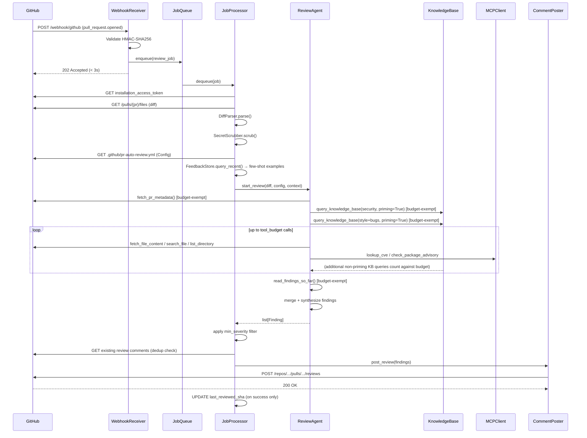
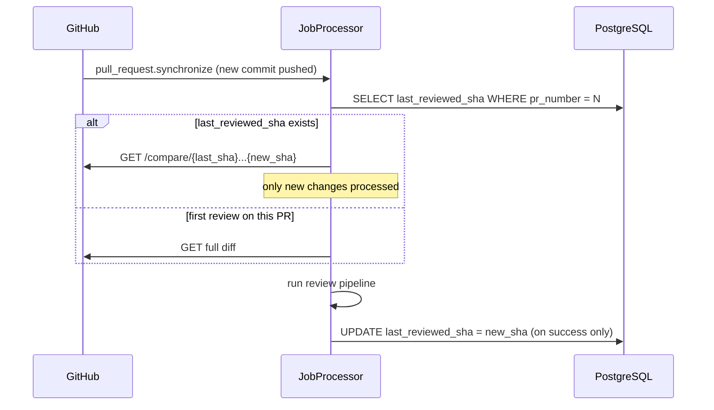
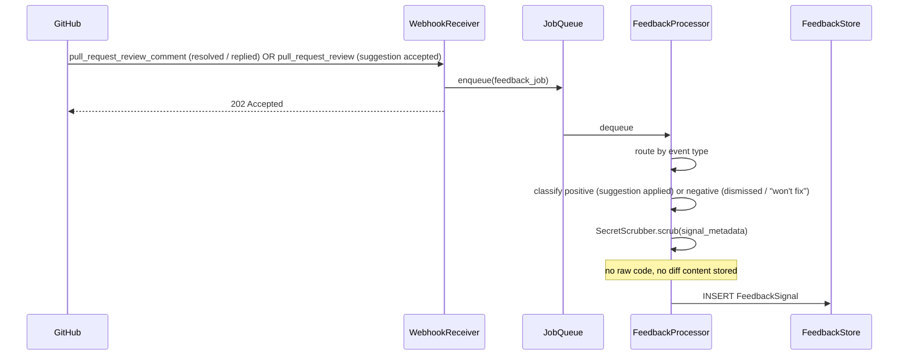
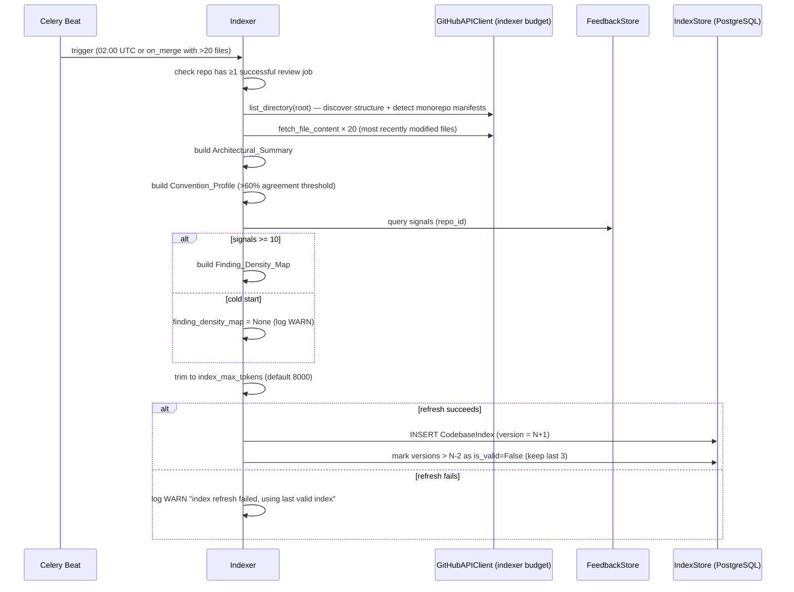

# Design Document: GitHub PR Auto-Review

## Overview

This service automatically reviews GitHub pull requests using an LLM-backed agent, posting inline code comments with categorised findings (bugs, security, style, performance). A webhook receiver enqueues review jobs into Redis, Celery workers orchestrate the review pipeline, and the agent uses a configurable tool budget to fetch file context and query a RAG knowledge base before posting results via the GitHub Reviews API.

v1 (Requirements 1–11) delivers the complete review pipeline with knowledge base, feedback loop, and evaluation harness. v2 (Requirements 12–17) adds persistent codebase memory (Codebase_Index), expanded MCP server ecosystem, and cross-repository learning. v2 sections are marked **[v2]**. `requirements.md` and `requirements-v2.md` are the authoritative source of acceptance criteria. This document resolves all architecture decisions and flagged design constraints.

---

## Architecture Decision

**Decision:** Deploy as a single FastAPI application with Celery workers, not as microservices.

**Rationale:**
- Single team, early stage — microservice overhead (network contracts, independent deploys, distributed tracing setup) delivers no value yet
- All components share the same GitHub App credentials, Config loader, and database — extracting them adds round-trips with no benefit
- The Job_Queue already provides the key async decoupling the spec requires (Req 8)
- The Indexer [v2] is the only candidate for extraction — it has genuinely different scaling and scheduling needs. It runs as a separate Celery queue on the same worker fleet, which is sufficient isolation without a separate service

**Extraction triggers (not now):** extract Indexer to a separate service when it creates measurable API quota contention with review jobs in production. Extract Knowledge_Base to a separate service only if retrieval latency exceeds 500ms p99 under real load.

---

## System Architecture

```
                        ┌─────────────────────────────────┐
                        │             GitHub               │
                        │  (webhooks, REST API, Reviews)   │
                        └────┬──────────────────────┬──────┘
                             │ webhook               │ API calls
                    ┌────────▼────────┐              │
                    │ WebhookReceiver │              │
                    │  (FastAPI)      │              │
                    │  HMAC validate  │              │
                    │  rate limit     │              │
                    │  ack < 3s       │              │
                    └────────┬────────┘              │
                             │ enqueue               │
                    ┌────────▼────────┐              │
                    │   JobQueue      │              │
                    │   (Redis)       │              │
                    │  review_jobs    │              │
                    │  feedback_jobs  │              │
                    │  indexer_jobs   │              │
                    └────────┬────────┘              │
                             │ dequeue               │
                    ┌────────▼──────────────────────▼──────┐
                    │          Celery Workers               │
                    │  (max 10 concurrent review_jobs)      │
                    │                                       │
                    │  ┌─────────────┐  ┌───────────────┐  │
                    │  │ JobProcessor│  │ FeedbackProc  │  │
                    │  │             │  │               │  │
                    │  │ DiffParser  │  │ SignalClassify │  │
                    │  │ SecretScrub │  │ FeedbackStore │  │
                    │  │ ConfigLoad  │  └───────────────┘  │
                    │  │ ReviewAgent │                      │
                    │  │ CommentPost │  ┌───────────────┐  │
                    │  └─────────────┘  │ Indexer [v2]  │  │
                    │                   │ (Celery Beat) │  │
                    │                   └───────────────┘  │
                    └───────────────────────────────────────┘
                             │
          ┌──────────────────┼──────────────────┐
          │                  │                  │
   ┌──────▼──────┐   ┌───────▼───────┐   ┌─────▼──────┐
   │ PostgreSQL  │   │  ChromaDB     │   │   Redis    │
   │             │   │  (HTTP server)│   │            │
   │ jobs        │   │ org_guidelines│   │ job queue  │
   │ feedback    │   │ lang_practices│   │ rate limit │
   │ findings    │   │ cve_snapshot  │   │ token cache│
   │ index [v2]  │   │ fix_kb        │   └────────────┘
   │ corpus_ver  │   │ lessons_learn │
   └─────────────┘   │ cross_repo[v2]│
                     └───────────────┘

   ┌─────────────────────────────────────────────┐
   │  Evaluation Harness (separate package)       │
   │  Inspect AI tasks, LiteLLM judges            │
   │  No runtime dependency on PR_Reviewer        │
   │  Reads from shared PostgreSQL schema         │
   └─────────────────────────────────────────────┘

   ┌─────────────────────────────────────────────┐
   │  OTel Collector + Backend                    │
   │  Receives traces, metrics, logs via OTLP     │
   └─────────────────────────────────────────────┘
```

---

## Components and Interfaces

### WebhookReceiver

- FastAPI router at `POST /webhook/github`
- Rate limited to 100 requests/minute per source IP via `slowapi` — returns 429 on excess (Req security posture)
- Validates `X-Hub-Signature-256` HMAC-SHA256 against webhook secret — rejects 401 on mismatch (Req 1.3)
- Reads `X-GitHub-Event` header to route:
  - `pull_request` events → `review_jobs` queue
  - `pull_request_review_comment` events → `feedback_jobs` queue (resolved/replied signals)
  - `pull_request_review` events → `feedback_jobs` queue (suggestion accepted/dismissed signals; Req 9.1)
- Enqueues and returns `202 Accepted` within 3 seconds (Req 1.4)
- Checks draft state from payload before enqueuing (Req 1.14) — skip if draft and `review_draft_prs: false`

### JobQueue

- Redis-backed Celery with three named queues and explicit priorities:
  - `review_jobs` (priority 9) — PR review tasks; max 10 concurrent workers to satisfy 10-minute SLO (Req 8.3)
  - `feedback_jobs` (priority 5) — feedback signal recording
  - `indexer_jobs` (priority 1) — scheduled Indexer runs [v2]
- Dead letter: Celery's `task_acks_late + max_retries=3` pattern; on exhaustion, job state set to `dead_letter` and a failure comment is posted (Req 1.13)
- Queue depth emitted as OTel gauge `review.queue_depth` on every enqueue and dequeue

### JobProcessor

Orchestrates the review pipeline for a dequeued job:

1. Fetch GitHub App Installation_Access_Token (refresh if within 5 min of expiry, Req 1.11)
2. Dedup check: fetch existing bot reviews for this commit SHA — if found, log deduplication notice and skip (Req 1.6/1.7)
3. Fetch raw diff via GitHub API (incremental diff via compare endpoint if `last_reviewed_sha` exists; Req 1.8)
4. `DiffParser.parse(raw_diff, config)` → `StructuredDiff`
5. `SecretScrubber.scrub(diff_content)` → `(scrubbed_diff, detections)`
6. `ConfigLoader.load(repo)` → `Config`
7. Query `FeedbackStore.query_recent(repo_id, file_path_patterns, limit=5)` and inject as few-shot examples into agent context (Req 9.5)
8. **[v2]** If `codebase_index_enabled: true`: fetch `CodebaseIndex` from Index_Store; compare `CodebaseIndex.commit_sha` to current default branch HEAD — if >500 commits behind, log WARN and trigger out-of-schedule Indexer refresh (non-blocking; current job continues with stale index); inject index into agent initial context
9. `ReviewAgent.run(structured_diff, config, context)` → `list[Finding]`
10. Apply `min_severity` filter: remove Findings below configured threshold before proceeding
11. Fetch existing comments for dedup (Req 5.10)
12. `CommentPoster.post(findings, pr)` → GitHub review
13. On success: update `last_reviewed_sha = new_commit_sha` in jobs table

### DiffParser

- Stateless, pure Python
- Parses unified diff format into `StructuredDiff`
- Preserves GitHub pull request line position index per changed line (Req 2.2)
- Applies ignore patterns from Config (Req 2.3/2.4):
  - If both `ignore_patterns_override` and `ignore_patterns_extend` present: `override` takes precedence, `extend` is ignored, log WARN "conflicting ignore fields; override applied" (Req 2.5)
- Truncates at 3,000 changed lines with truncation notice in structured output (Req 2.7)
- Skips binary files and records them in `skipped_files` (Req 2.6)

### SecretScrubber

- Uses `detect-secrets` library with all plugin detectors enabled
- Input: raw string content; output: `(scrubbed: str, detections: list[Detection])`
- Never mutates the input string — returns a new string (immutability)
- Called on: diff content before LLM submission, fetched file content, Knowledge_Base retrieved entries
- If triggered on Knowledge_Base content: logs at ERROR level with `corpus` and `entry_id` (Req 11.7 — indicates upstream Req 9.7 violation)

### ReviewAgent

- LangChain agent with OpenAI GPT-4o as default provider (Req 3.1)
- Provider-pluggable via LangChain's `BaseChatModel` interface
- `ToolBudgetMiddleware` wraps each tool call: increments counter, raises `BudgetExhaustedError` at limit; budget-exempt tools bypass the counter (see Agent Tools section for mechanism)
- **Reasoning behaviour:**
  - Reasons iteratively; MAY interleave analysis across all four Review_Categories rather than processing them sequentially (Req 3.7)
  - Never chunks diffs mechanically by token count — fetches additional context on-demand via tools only (Req 3.13)
  - For low-confidence Findings: attempts one additional tool call to gather supporting evidence before finalizing, subject to Tool_Budget (Req 3.9)
  - On general `BudgetExhaustedError` (non-security path): finalizes current Findings and proceeds to posting; logs "tool budget reached" (Req 3.5)
  - On `BudgetExhaustedError` during security candidate verification: emits Escalation comment instead of discarding (Req 3.10)
  - After producing Findings: uses `list_directory` and `search_file` to check test coverage for modified functions; produces a Finding of category bugs where coverage is missing (Req 3.15)
- **Synthesis step** (Req 3.14): before finalizing for posting, calls `read_findings_so_far()` [budget-exempt] and:
  - Merges Findings that share the same `file_path` and `line_number` into a single Finding with a combined explanation covering all issues at that location
  - Annotates related Findings where a bug and security issue share the same root cause — the `related_finding_ids` list is populated and the plain-English explanation of each includes an inline cross-category note (e.g., "Note: this is also related to the security finding at line N")
- On LLM timeout (30s): retries once with 1s delay; on second failure, finalizes partial Findings and proceeds (Req 3.12)
- **[v2] Index-informed behaviour** when `CodebaseIndex` is present in initial context:
  - `Convention_Profile`: suppresses style Findings for patterns consistent with >60% of the sampled codebase (Req 13.1)
  - `Finding_Density_Map`: biases Tool_Budget allocation toward files and directories with historically high positive-signal rates; deprioritizes low-signal areas (Req 13.2)
  - `Architectural_Summary`: applies a lower confidence threshold before escalating security candidates in files identified as security boundary or hot-path files (Req 13.3)
  - `Architectural_Summary`: auto-discards security candidates found in files tagged as test fixtures — no Tool_Budget call consumed (Req 13.4)

### CommentPoster

- Formats `list[Finding]` into GitHub Reviews API payload
- Applies `min_severity` filter before constructing payload — Findings below threshold are suppressed (Req 7.4)
- Determines review status from remaining Finding severities (Req 5.3–5.7):
  - All low severity → `COMMENT`
  - Any medium, no high → `COMMENT`
  - Any high → `REQUEST_CHANGES`
  - No Findings (or all filtered by min_severity) → post "No issues found." with status `COMMENT`; if `auto_approve_on_no_findings: true` → status `APPROVE`
- Formats medium/high severity Findings with GitHub suggestion block syntax (Req 4.2/4.3/4.4); if a syntactically valid suggestion cannot be generated, omits the suggestion block and retains the plain-English explanation only (Req 4.6)
- Deduplicates against existing comments before constructing payload (Req 5.10)
- On 422 from GitHub API: logs invalid line reference, skips that comment, continues (Req 5.8)
- Constructs summary body: "Found N issue(s) across M category/categories." or "No issues found." (Req 5.9)

### ConfigLoader

- Fetches `.github/pr-auto-review.yml` from target repo via GitHub API
- Validates with Pydantic schema; on validation error: logs warning, returns defaults (Req 7.5)
- Returns `Config` dataclass (frozen/immutable)

### GitHubAPIClient

- Manages JWT → Installation_Access_Token exchange (Req 1.1)
- Token cache: stores token + expiry in Redis; proactively refreshes within 5 minutes of expiry
- On 401 auth error: logs error with full request context and halts processing for that job — does not retry (Req 1.9)
- On rate limit (403/429): reads `Retry-After` header, sleeps, retries up to 3 times (Req 1.10)
- Propagates W3C `traceparent` header on all outbound API calls (Observability section)
- **[v2]** Separate `GitHubAPIClient` instance for Indexer with its own rate limit token bucket (10 req/min), keyed `{installation_id}:indexer` in Redis

### KnowledgeBase

- ChromaDB running in **HTTP server mode** (sidecar container) from day 1; embedded mode is dev/test only — Celery multi-worker requires a shared vector store server
- Embedding model: `text-embedding-3-small` (OpenAI) — version pinned; `model_version` stored in every entry
- Six collections: `org_guidelines`, `language_best_practices`, `cve_snapshot`, `fix_knowledge_base`, `lessons_learned`, `cross_repo_fixes` [v2]
- Per-repo corpus enablement: `query_knowledge_base` checks the Config `knowledge_base` block and excludes collections that are disabled for the repository
- CVE snapshot staleness: before each security analysis job, checks `cve_snapshot` last refresh date; logs WARN if >14 days old (Req 11.8)
- `query_knowledge_base` returns top-5 entries by cosine similarity, filtered by `category` and `language` tags
- **Per-language corpus weighting** (Req 16.5): Config `knowledge_base.language_corpus_weights` map applies a multiplier to cosine similarity scores from the `language_best_practices` corpus for specific languages. Example:
  ```yaml
  knowledge_base:
    language_corpus_weights:
      python: 1.5   # boost Python best practices entries for Python-heavy repos
      go: 1.2
  ```
  When a diff contains mixed-language files, the per-file language detected by DiffParser determines which weight applies during retrieval for that file's findings. Default weight is `1.0` for all languages when not configured.
- Startup validation: checks all active entries share the same `model_version`; logs ERROR and refuses retrievals if mismatch detected; `query_knowledge_base` returns empty results with WARN during re-embedding

### MCPClient

- Thin HTTP client over MCP server protocol
- Propagates W3C `traceparent` header on all outbound calls
- **Endpoint configuration:** server base URLs are read from Config `mcp_servers` block (Req 11.10); defaults used when absent:
  ```yaml
  mcp_servers:
    nvd: https://services.nvd.nist.gov   # default NVD endpoint
    osv: https://api.osv.dev             # default OSV endpoint
  ```
  Custom endpoints override the defaults, enabling on-premise MCP proxies or alternate providers
- Per-server token bucket rate limiters (configurable; defaults: NVD 10 req/min, OSV 20 req/min)
- On rate limit exhaustion: falls back to `cve_snapshot` corpus; logs WARN with server name and fallback action; returns results tagged `source: fallback_corpus`
- Fallback chain: `live MCP server → cve_snapshot corpus → Escalation comment` (if neither available)

### FeedbackStore

- PostgreSQL-backed
- Never stores raw diff, code snippets, or Secret_Scrubber-redacted content (Req 9.7)
- `query_recent(repo_id, file_path_patterns, limit=5)` for few-shot context injection (Req 9.5)

### FeedbackProcessor

- Celery worker dequeuing `feedback_jobs`
- Routes by GitHub event type:
  - `pull_request_review_comment` (resolved or replied) → classifies as positive (suggestion applied) or negative (dismissed / "won't fix" reply)
  - `pull_request_review` (review submitted) → classifies suggestion acceptance as positive, dismissal as negative
- Extracts `file_path_pattern` and `finding_category` from the comment metadata
- Runs content through `SecretScrubber` before building `FeedbackSignal` — strips any raw code fragments
- Persists `FeedbackSignal` to `FeedbackStore`
- **[v2] Cross-repository learning** (Req 16.1): WHEN a positive signal is recorded (suggestion accepted) AND `cross_repo_sharing: true` in Config:
  - Extracts an abstract description of the code pattern that triggered the Finding (language, category, vulnerability type if security, abstract pattern description — no raw code)
  - Runs extracted pattern through `SecretScrubber` and code-concreteness classifier (rejects if >3 lines match code syntax)
  - Persists to `cross_repo_fixes` KnowledgeBase collection, tagged with language, Review_Category, vulnerability type, and installation_id for scoping
  - `cross_repo_sharing` is `false` by default; must be opted in per-repo

### Indexer [v2]

- Celery Beat task on `indexer_jobs` queue (lowest priority)
- Only begins indexing a repo after its first successful PR review job completes (Req 12.1)
- Default schedule: 02:00 UTC daily; additional trigger on `push` to default branch with >20 file changes (Req 12.6)
- Uses separate `GitHubAPIClient` instance with isolated rate limit budget (v2 DC4)
- **Monorepo detection:** scans root directory for package manifests (`package.json`, `pyproject.toml`, `go.mod`, `Cargo.toml`); if manifests found in subdirectories, builds a separate `CodebaseIndex` per package; on a multi-package PR, injects only sections for modified packages, merging up to `index_max_tokens`; if combined exceeds limit, prioritizes packages with the most changed files (Req 14.3/14.4)
- **Convention_Profile sampling:** fetches the 20 most recently modified files by commit timestamp; patterns must appear in >60% of samples to be included; below threshold, marks as `mixed` and omits (v2 DC2 resolution)
- **Finding_Density_Map:** omitted if `FeedbackStore` has fewer than 10 signals for the repo; logs WARN with signal count (v2 DC3 resolution)
- **On refresh failure:** logs WARN, continues using last valid `CodebaseIndex` — does not fail review jobs (Req 12.8)
- Stores versioned `CodebaseIndex` in PostgreSQL; retains last 3 versions; old versions marked `is_valid: False` but not deleted

### Evaluation Harness

- Separate Python package in `eval/` directory; **zero runtime imports from the `pr_reviewer` package** (Req 10.1)
- Accesses the same PostgreSQL instance via shared schema for reading stored `Finding` records; never reads raw diff content (Req 10.10)
- **Inspect AI task suite:** `inspect eval eval/tasks/` from CLI; `inspect view` for per-sample trace and judge rationale browsing (Req 10.9)
- **Judge suite** — all LiteLLM-compatible, each returns `{score: int, rationale: str}` (Req 10.3):
  - `relevance_judge` (0–10): Finding references something actually present in the diff
  - `accuracy_judge` (0–10): diagnosis is technically correct per ground-truth labels
  - `actionability_judge` (0–10): suggested fix is implementable as written
  - `clarity_judge` (0–10): plain-English explanation is clear to a junior developer
  - `verification_trace_judge` (0–10): agent actually verified security candidate via tool call before confirming or discarding
  - `quality_with_cot_judge` (0–10): overall review quality with chain-of-thought rationale
- **Scoring:** per-finding scores reported as a vector `[relevance, accuracy, actionability, clarity]` — never aggregated into a single mean (Req 10.4)
- **Classical metrics** (Req 10.5):
  - Schema validity: every Finding output conforms to the `Finding` dataclass schema
  - Regex contains-check: security Findings reference a specific line number and file path
  - Token F1 against reference fixes for known bugs in corpus
- **Same-family bias detection:** security `verification_trace_judge` run with ≥2 different LLM model families; score delta reported; judge model for security must differ from GPT-4o (e.g., Claude Sonnet) (Req 10.7)
- **Meta-prompting loop** (Req 10.8):
  1. Identify 5 lowest-scoring reviews by `quality_with_cot_judge`
  2. Submit those reviews + current system prompt to a reflector LLM
  3. Reflector diagnoses one specific failure mode, produces revised system prompt
  4. Re-run Review_Agent on same inputs with revised prompt, re-judge
  5. Report score delta to engineering team before approving prompt change for deployment
- **Two trigger modes** (Req 10.10):
  1. Pre-ship: full corpus run; zero-FP gate on security must pass before any prompt change or model update ships
  2. Weekly: 10 live reviews sampled from stored `Finding` records (not raw diff); human vibe check (1–5 score per review) logged alongside `quality_with_cot_judge` scores; human-vs-judge correlation tracked to monitor judge reliability
- **Summary report** after each run (Req 10.11): precision/recall/FP per category; per-dimension finding scores; average cost and latency per review; Tool_Budget consumption distribution; delta vs previous run; corpus version active during run; accumulated feedback signal count per repository and per Review_Category (Req 9.8)
- **Knowledge retrieval quality check** (Req 10.12): for each security Finding in labeled corpus, verify ≥1 KB entry was retrieved and injected before the Finding was produced; flag Findings with no retrieval in the eval report
- **[v2] Req 17 — Knowledge Retrieval Quality Measurement:**
  - Ablation tests: run corpus with and without KB retrieval enabled; report delta in precision, recall, and FP rate per category (Req 17.1)
  - Retrieval relevance: for each `query_knowledge_base` call, score retrieved entries against the produced Finding using `relevance_judge`; report mean retrieval relevance per corpus (Req 17.2)
  - Budget attribution: track Tool_Budget consumption from KB calls separately from codebase context calls (Req 17.3)
  - Corpus flagging: when mean retrieval relevance for a corpus falls below 0.6 across 3 consecutive eval runs, flag that corpus for re-embedding and notify the engineering team (Req 17.4)
  - [v2] Eval Harness runs the test suite with and without `CodebaseIndex` and reports delta in precision, recall, and FP rate to measure index contribution (Req 13.5)

---

## Data Models

All models are immutable (`frozen=True` dataclasses or Pydantic models with `model_config = ConfigDict(frozen=True)`).

### Job

```python
@dataclass(frozen=True)
class Job:
    id: UUID
    repo_id: str
    installation_id: int
    pr_number: int
    commit_sha: str
    last_reviewed_sha: str | None  # for incremental diff (Req 1.8)
    status: JobStatus              # queued | processing | complete | failed | dead_letter
    attempts: int
    created_at: datetime
    updated_at: datetime
    context_tokens_used: int | None  # tracked post-completion for budget monitoring
```

### Finding

```python
@dataclass(frozen=True)
class Finding:
    id: UUID
    job_id: UUID
    file_path: str
    line_number: int
    start_line: int | None   # multi-line suggestion only
    category: ReviewCategory # bugs | security | style | performance
    severity: Severity       # low | medium | high
    confidence: Confidence   # low | medium | high
    explanation: str
    suggestion: str | None   # None for low severity or when valid suggestion cannot be generated
    is_escalation: bool
    related_finding_ids: list[UUID]  # cross-category annotations (Req 3.14)
```

### FeedbackSignal

```python
@dataclass(frozen=True)
class FeedbackSignal:
    id: UUID
    repo_id: str
    finding_category: ReviewCategory
    file_path_pattern: str
    signal_type: SignalType  # positive | negative
    timestamp: datetime
    # no raw code, no diff content, no scrubber-redacted fields (Req 9.7)
```

### KnowledgeBaseEntry

```python
@dataclass(frozen=True)
class KnowledgeBaseEntry:
    id: UUID
    corpus: Corpus        # org_guidelines | language_best_practices | cve_snapshot |
                          # fix_knowledge_base | lessons_learned | cross_repo_fixes
    content: str
    language_tag: str | None
    severity_tag: str | None   # for CVE entries
    entry_version: int         # entry-level version (incremented on update)
    corpus_version_id: UUID    # links to CorpusVersion snapshot (Req 16.4)
    is_active: bool            # False = deprecated; excluded from retrieval
    is_draft: bool             # True = pending approval; excluded from retrieval
    last_updated: datetime
    model_version: str         # embedding model version — must match across corpus
```

`lessons_learned` entries store `content` as structured JSON with four required fields:
```json
{
  "problem_description": "...",   // min 50 chars
  "code_pattern": "...",          // abstract only, min 50 chars, no raw code
  "root_cause": "...",
  "resolution": "..."
}
```

### CorpusVersion [v2]

Corpus-level versioning for rollback (Req 16.4). Separate from entry-level `entry_version`.

```python
@dataclass(frozen=True)
class CorpusVersion:
    id: UUID
    corpus: Corpus
    version: int             # monotonically increasing per corpus
    is_active: bool          # exactly one active version per corpus at any time
    activated_at: datetime
    deactivated_at: datetime | None
```

`kb rollback --corpus X --version N` deactivates the current version and sets version N as active, excluding entries from newer versions from retrieval. Last 5 versions retained per corpus.

### CodebaseIndex [v2]

```python
@dataclass(frozen=True)
class CodebaseIndex:
    repo_id: str
    package_path: str | None     # None for single-repo; subdirectory path for monorepo
    version: int
    commit_sha: str              # default branch HEAD at index build time
    architectural_summary: dict
    convention_profile: dict | None  # None if <60% pattern agreement on any field
    finding_density_map: dict | None  # None if <10 feedback signals (cold start)
    token_count: int
    scope: IndexScope            # single | monorepo
    is_valid: bool
    created_at: datetime
```

---

## API Surface

### Webhook Endpoint

```
POST /webhook/github
Headers:
  X-Hub-Signature-256: sha256=<hmac>
  X-GitHub-Event: pull_request | pull_request_review_comment | pull_request_review | ...
Body: GitHub webhook JSON payload
Response: 202 Accepted  (within 3 seconds)
         401 Unauthorized  (HMAC mismatch)
         429 Too Many Requests  (rate limit exceeded)
```

### Health Check Endpoint

```
GET /health
Response: 200 {"status": "ok", "db": "ok", "redis": "ok", "chromadb": "ok"}
          503 {"status": "degraded", "db": "ok", "redis": "error", "chromadb": "ok"}
```

Used for Kubernetes liveness and readiness probes.

### Agent Tools

Budget accounting is enforced by `ToolBudgetMiddleware`. Tool signatures are the canonical API — no other definition exists.

**Budget-exempt mechanism:** `query_knowledge_base` accepts a `priming: bool = False` parameter. When `priming=True`, `ToolBudgetMiddleware` does not increment the counter. The agent passes `priming=True` for the two mandatory pre-analysis calls (security priming, style/bugs priming). All other `query_knowledge_base` calls use the default `priming=False` and count against the budget.

```python
# ── Budget-exempt ─────────────────────────────────────────────────────────────

def fetch_pr_metadata(pr_number: int) -> PRMetadata:
    """PR title, description, linked issues, author. First call on every job."""

def read_findings_so_far() -> list[Finding]:
    """All Findings produced in the current job. Called once in synthesis step."""

def query_knowledge_base(query: str, category: str, language: str, priming: bool = False) -> list[KBEntry]:
    """
    Semantic search against KnowledgeBase. Returns top-5 entries.
    Pass priming=True for mandatory pre-analysis calls (Req 11.4, 11.6) — those are budget-exempt.
    All other calls (priming=False, the default) count against Tool_Budget.
    """

# ── Counts against Tool_Budget ────────────────────────────────────────────────

def fetch_file_content(path: str, ref: str) -> str:
    """Full content of file at git ref. Content is Secret_Scrubber-cleaned before return."""

def search_file(path: str, pattern: str) -> list[Match]:
    """Lines in file matching regex pattern."""

def list_directory(path: str, ref: str) -> list[str]:
    """Files in directory at git ref."""

def get_symbol_usages(symbol: str, path: str) -> list[Match]:
    """Lines in file where symbol is referenced."""

def lookup_cve(pattern_or_cve_id: str) -> list[CVEAdvisory]:
    """Live CVE lookup via MCP_Server (NVD/OSV). Falls back to cve_snapshot on rate limit."""

def check_package_advisory(package_name: str, version: str, ecosystem: str) -> list[Advisory]:
    """Live package advisory lookup via MCP_Server (OSV). Falls back to cve_snapshot on rate limit."""

# ── v2 — Counts against Tool_Budget ──────────────────────────────────────────

def run_linter(file_path: str, language: str, ruleset: str) -> list[LinterFinding]:
    """
    Invokes bundled linter in subprocess (30s timeout).
    Called for style analysis on changed files up to max_linter_files per job (default: 5),
    prioritized by most changed lines. If lintable files exceed max_linter_files, logs which
    files were skipped.
    """

def check_license(package_name: str, ecosystem: str) -> LicenseResult:
    """
    Checks new dependency against repo license policy.
    Called when a diff adds a new entry to a manifest file
    (package.json, requirements.txt, go.mod, Cargo.toml, etc.).
    """

def ghsa_lookup(ecosystem: str, package: str, version: str) -> list[Advisory]:
    """GitHub Advisory Database lookup via MCP_Server."""

def snyk_lookup(package: str, version: str, ecosystem: str) -> list[Advisory]:
    """Snyk vulnerability database lookup via MCP_Server."""

def owasp_check(code_pattern: str, language: str) -> list[OWASPMatch]:
    """Matches code pattern against OWASP Top 10 signatures via MCP_Server."""
```

### Knowledge Base CLI [v2]

```bash
# Add entries
kb add --corpus lessons_learned --file entry.json          # immediate (requires all 4 fields, min 50 chars each)
kb add --corpus lessons_learned --file entry.json --draft  # requires kb approve before retrievable
kb add --corpus org_guidelines --file guidelines.md
kb add --corpus cve_snapshot --file cves.jsonl             # bulk seed

# Lifecycle
kb approve <entry-id>     # second-team-member approval for draft entries
kb deprecate <entry-id>   # soft-delete: is_active=False, retained for audit

# Inspection
kb list --corpus lessons_learned [--include-drafts] [--include-deprecated]
kb show <entry-id>

# Versioning and maintenance
kb rollback --corpus cve_snapshot --version 3    # reactivate previous corpus version (retains last 5)
kb reembed --corpus all                          # re-embed after model version change
kb validate --corpus lessons_learned             # schema + quality check without adding
kb bootstrap                                     # seed cve_snapshot and language_best_practices on first deploy
```

---

## Sequence Diagrams

### PR Review — Happy Path



### Per-Commit Incremental Diff



### Feedback Signal Recording



### Indexer — Scheduled Refresh [v2]



---

## Technology Stack

| Concern | Choice | Rationale |
|---|---|---|
| Web framework | FastAPI | Already in pyproject.toml; async-native; 3s ack SLO is trivial |
| Webhook rate limiting | slowapi | Thin FastAPI middleware; prevents webhook replay/abuse |
| Task queue | Celery + Redis | Mature; priorities, dead letter, Beat scheduling all built-in; no additional service |
| LLM orchestration | LangChain | Already in pyproject.toml; `BaseChatModel` abstraction satisfies provider-pluggable requirement (Req 3.1) |
| Primary LLM | OpenAI GPT-4o | Required by Req 3.1 |
| Embedding model | `text-embedding-3-small` (OpenAI) | Good quality/cost; consistent across all corpora; version pinned in `model_version` field |
| Vector store | ChromaDB (HTTP server mode) | Self-hosted sidecar; data residency guaranteed; swap to managed if scale requires |
| Relational DB | PostgreSQL | Jobs, Feedback_Store, Index_Store, CorpusVersion all fit naturally; single DB reduces ops surface |
| Secret detection | `detect-secrets` | Battle-tested; extensible plugin system; returns detections without mutating input |
| Config validation | Pydantic | FastAPI-native; clear validation errors; frozen models enforce immutability |
| Observability | OpenTelemetry SDK + OTLP exporter | Standard instrumentation; decoupled from backend via OTel Collector |
| Eval framework | Inspect AI | Required by Req 10.9; CLI runner + trace viewer built-in |
| Eval judge calls | LiteLLM | Required by Req 10.3; multi-provider abstraction; `litellm.completion_cost` for cost tracking |

---

## Context Window Budget Allocation

Resolves v2 Design Constraint 1 (index size vs context window).

GPT-4o context window: 128,000 tokens.

| Slot | Allocation | Notes |
|---|---|---|
| System prompt | ~2,000 | Fixed; includes tool definitions |
| Structured diff | ≤10,000 | 3,000 changed lines × ~3 tokens/line |
| Few-shot feedback examples (≤5) | ≤1,500 | Req 9.5 |
| Codebase_Index [v2] | ≤8,000 | Configurable; default 8,000 |
| KB priming results (3 calls × 5 entries) | ≤3,000 | Budget-exempt calls |
| Tool call results (up to 20 calls) | ≤20,000 | Variable; bounded by Tool_Budget |
| **Total used** | **~44,500** | |
| **Remaining buffer** | **~83,500** | Well within limit |

At 128K context, there is no pressure. Track `context_tokens_used` per job in the Job record and emit a WARNING log if it exceeds 100,000 (80% of window) to detect drift before it becomes a problem.

---

## Design Constraint Resolutions

### Req 1.8 — Per-Commit Incremental Diff

Use `GET /repos/{owner}/{repo}/compare/{base}...{head}` (GitHub compare endpoint). Store `last_reviewed_sha` in the `jobs` table per PR. On `pull_request.synchronize`, diff only `{last_reviewed_sha}...{new_head_sha}`. Update `last_reviewed_sha` only after successful review posting — never on failure, so a failed job retries against the full delta.

### v2 DC1 — Index Size vs Context Window

Resolved in Context Window Budget Allocation section. 8,000-token default is safe with substantial headroom.

### v2 DC2 — Convention Inference Accuracy

Sample strategy: fetch the 20 most recently modified files by commit timestamp. A pattern must appear in >60% of sampled files to be included in `Convention_Profile`. Below 60%, the pattern is marked `mixed` and omitted — the agent does not suppress Findings based on mixed patterns. For repos with <10 files, sample all files.

### v2 DC3 — Finding_Density_Map Cold Start

Minimum threshold: 10 feedback signals per repo before the `Finding_Density_Map` is computed. Below threshold, `finding_density_map` is stored as `null` and the Indexer logs: `"insufficient signal for density map: {n} signals, need 10"`. The Review_Agent receives no density guidance and applies uniform Tool_Budget allocation across files.

### v2 DC4 — Indexer Resource Isolation

Indexer uses a separate `GitHubAPIClient` instance with its own Redis token bucket (10 req/min). Review job client has its own token bucket (30 req/min). Buckets are keyed by `{installation_id}:indexer` vs `{installation_id}:review` in Redis, so they never share quota. Indexer schedule defaults to 02:00 UTC to avoid peak review traffic.

### v2 DC5 — Privacy (Index_Store)

`Index_Store` is per-installation. No index data leaves the deployment environment. For SaaS deployments, all records are scoped by `installation_id`. This must be documented in the data processing agreement for any cloud-hosted deployment.

### Req 14.2 — Index Staleness (500-commit threshold)

On every review job start (step 8 of JobProcessor), compare `CodebaseIndex.commit_sha` to the current default branch HEAD via GitHub API. If >500 commits behind: log WARN `"codebase index stale: {n} commits behind"` and enqueue an out-of-schedule Indexer refresh on `indexer_jobs`. The current job continues with the stale index — it is non-blocking. Review quality may be reduced but the review is not blocked.

### Req 14.3/14.4 — Monorepo Index Injection

Indexer detects monorepo by scanning root for package manifests (`package.json`, `pyproject.toml`, `go.mod`, `Cargo.toml`). For each manifest found in a subdirectory, it builds a separate `CodebaseIndex` with `package_path` set to that subdirectory. On a PR that modifies files in multiple packages, JobProcessor merges the relevant per-package index sections up to `index_max_tokens`. If the combined size exceeds the token limit, it prioritizes packages containing the most changed files and logs which packages were truncated.

### v2 Knowledge DC1 — Embedding Model Consistency

Model pinned to `text-embedding-3-small`. Every `KnowledgeBaseEntry` record stores `model_version`. On `KnowledgeBase` startup: query all active entries and assert all share the same `model_version`. If mismatch detected: log ERROR `"embedding model version mismatch"`, refuse to serve retrievals, and require `kb reembed --corpus all` before re-enabling.

### v2 Knowledge DC2 — MCP Server Rate Limits

Per-server token buckets in Redis. On exhaustion: fall back to `cve_snapshot` corpus; log WARN with server name and fallback action; return results tagged `source: fallback_corpus`. Fallback chain: `live MCP → cve_snapshot → Escalation comment`. An Escalation noting "could not verify against live CVE data" is always preferable to dropping the security candidate silently.

### v2 Knowledge DC3 — Cross-Repository Fix Corpus Privacy

Store abstract patterns only. The `Feedback_Store → cross_repo_fixes` pipeline runs content through: (1) `SecretScrubber`, (2) code-concreteness classifier — rejects entries with >3 lines of code-like syntax. Per-repo opt-in: `cross_repo_sharing: false` by default in Config.

### v2 Knowledge DC4 — Linter Execution Environment

Linters bundled in container image (version-pinned in `Dockerfile`): ESLint 8.x, Pylint 3.x, golangci-lint 1.x, Clippy (Rust). Run in isolated subprocess with 30-second timeout. Missing linters log WARN at startup but do not block the service. `run_linter` returns empty results if the language's linter is unavailable.

### v2 Knowledge DC5 — Knowledge_Base Cold Start

`kb bootstrap` run on first deployment seeds `cve_snapshot` (top 1,000 CVEs by CVSS ≥ 7.0) and `language_best_practices` from bundled markdown files. Minimum viable corpus: ≥5 CVE entries and ≥1 guidelines document. Below minimum, `query_knowledge_base` returns `[]` with WARN — review jobs continue without KB context.

### v2 Knowledge DC6 — Lessons-Learned Entry Quality

CLI enforces: all four fields required, minimum 50 characters each, `code_pattern` must pass code-concreteness check. `--draft` flag gates on second-team-member approval via `kb approve`. Deprecation is soft-delete only (`is_active: False`), never hard-delete.

---

## Observability

OTel setup is the first implementation task for any new service. All instrumentation uses the OpenTelemetry Python SDK and exports via OTLP to the OTel Collector.

### Traces

- One trace per review job; `job_id` is the root span
- Child spans for every: tool call, GitHub API call, MCP server call, KB query, LLM API call
- W3C `traceparent` header propagated on all outbound HTTP requests (GitHub API, MCP servers, OpenAI API)
- Span attributes: `repo_id`, `pr_number`, `commit_sha`, `tool_name` (for tool call spans)

### Metrics — Golden Signals

Success latency and error latency tracked **separately** — never blended (blended p99 hides failures behind fast error responses):

| Metric | Type | Tags | Notes |
|---|---|---|---|
| `review.duration_ms` | Histogram (p50/p95/p99) | `status`, `category` | Success-only variant for SLO burn rate |
| `review.jobs_started` | Counter | `repo_id` | Reviews per minute / throughput |
| `review.errors` | Counter | `error_type` | `llm_timeout`, `github_api_error`, `budget_exhausted`, `auth_error`, `mcp_fallback` |
| `review.queue_depth` | Gauge | `queue_name` | Emitted on every enqueue AND dequeue |
| `review.tool_budget_used` | Histogram | `repo_id` | Distribution of budget consumption |
| `kb.retrieval_latency_ms` | Histogram | `corpus` | Tracks if KB retrieval becomes a bottleneck |
| `kb.retrieval_relevance` | Gauge | `corpus` | From eval runs; triggers alert below 0.6 |

### Logging

- Format: structured JSON; every entry includes `job_id`, `repo_id`, `trace_id`, `span_id`
- Log levels by environment: `DEBUG` (dev — log all), `INFO` (staging — log flows and outcomes), `WARN` (prod — warnings and errors only)
- Logs are event streams emitted to stdout only — no file logging; the container runtime collects them
- Error log rate limiting: identical error messages are deduplicated within a 60-second window to prevent log flood during outages

---

## 12-Factor Compliance and Security Posture

### Configuration and Secrets

All secrets and environment-specific config via environment variables — never in source code or config files:

| Variable | Purpose |
|---|---|
| `GITHUB_APP_PRIVATE_KEY` | RSA private key for JWT signing |
| `GITHUB_APP_ID` | GitHub App identifier |
| `GITHUB_WEBHOOK_SECRET` | HMAC secret for webhook signature validation |
| `OPENAI_API_KEY` | LLM and embedding API key |
| `DATABASE_URL` | PostgreSQL connection string |
| `REDIS_URL` | Redis connection string |
| `CHROMADB_URL` | ChromaDB HTTP server endpoint |

### Stateless Processes

Celery workers are stateless — all job state lives in PostgreSQL and Redis. Any worker can dequeue and process any job. A worker crash loses no state; the job is requeued by Celery's `task_acks_late` setting.

### Logs as Event Streams

Workers write only to stdout. No file logging. The container runtime (Docker/Kubernetes) collects stdout and forwards to the log aggregator. This keeps the application portable and compliant with Factor XI.

### Webhook Security

Rate limited to 100 requests/minute per source IP (slowapi). HMAC-SHA256 signature validated on every request before any processing occurs. 401 returned immediately on mismatch; request body never deserialized.

### Health Check

`GET /health` returns component status for PostgreSQL, Redis, and ChromaDB. Used for Kubernetes liveness and readiness probes. A degraded component (e.g., ChromaDB unavailable) returns 503 so the load balancer can route traffic away.

---

## Correctness Properties

### Property 1: Webhook authentication

For any incoming POST to `/webhook/github`, the receiver SHALL accept the request if and only if `X-Hub-Signature-256` contains a valid HMAC-SHA256 signature computed from the request body using the configured webhook secret; all other requests SHALL be rejected with 401.

**Validates: Requirements 1.3**

---

### Property 2: Diff truncation bound

For any raw diff input of arbitrary size, `DiffParser.parse` SHALL produce a `StructuredDiff` containing at most 3,000 changed lines and SHALL set `truncated=True` with a non-empty `truncation_notice` when the input exceeds that threshold.

**Validates: Requirements 2.7**

---

### Property 3: Ignore pattern conflict resolution

For any Config with both `ignore_patterns_override` and `ignore_patterns_extend` present, `DiffParser` SHALL apply only the `override` list, ignore the `extend` list entirely, and log a WARN message containing "conflicting ignore fields".

**Validates: Requirements 2.5**

---

### Property 4: Tool budget enforcement

For any review job with `tool_budget = N`, the number of non-priming tool calls made by `ReviewAgent` SHALL NOT exceed N; the (N+1)th non-priming call SHALL raise `BudgetExhaustedError` without executing.

**Validates: Requirements 3.5**

---

### Property 5: Secret scrubbing purity

For any input string containing no detectable secrets, `SecretScrubber.scrub` SHALL return a new string whose content is byte-for-byte identical to the input, without mutating the original object.

**Validates: Requirements 3.6, 3.11**

---

### Property 6: Finding immutability

For any `Finding` object returned by `ReviewAgent.run`, every field assignment attempt SHALL raise `FrozenInstanceError`; the object graph rooted at any `Finding` SHALL be immutable.

**Validates: Requirements 3.8**

---

### Property 7: Feedback signal integrity

For any `FeedbackSignal` persisted to `FeedbackStore`, the record SHALL contain no field named `code`, `diff`, `content`, or `snippet`; raw source code and diff content SHALL never be stored in the feedback table.

**Validates: Requirements 9.7**

---

### Property 8: Knowledge base retrieval bound

For any `query_knowledge_base` call regardless of corpus size, the number of entries returned SHALL NOT exceed 5.

**Validates: Requirements 11.1**

---

### Property 9: Codebase index token bound [v2]

For any `CodebaseIndex` produced by the Indexer, `token_count` SHALL NOT exceed `config.index_max_tokens`; content SHALL be trimmed before storage if the raw index exceeds the limit.

**Validates: Requirements 12.9**

---

### Property 10: Convention profile threshold [v2]

For any pattern sampled by the Indexer across N files, the pattern SHALL be included in `Convention_Profile` if and only if it appears in strictly more than 60% of the sampled files; patterns at or below 60% SHALL be marked `mixed` and omitted from the profile.

**Validates: Requirements 12.4**

---

## Testing Strategy

### Framework

- **Unit and integration tests**: pytest with pytest-asyncio; coverage enforced at ≥80% via pytest-cov
- **Test database**: PostgreSQL in Docker (pytest fixture; transactions rolled back per test)
- **Test vector store**: ChromaDB HTTP server in Docker (pytest fixture)
- **HTTP client**: httpx `AsyncClient` for FastAPI endpoint tests
- **Async task tests**: Celery in `CELERY_TASK_ALWAYS_EAGER=True` mode for unit tests; real Redis for integration tests

### Unit tests

- Pure components (DiffParser, SecretScrubber, ConfigLoader) tested with no I/O; all correctness properties verified
- All dataclasses and Pydantic models: frozen-instance assertion, field validation, enum membership
- ToolBudgetMiddleware: budget counting per exempt vs non-exempt tool call, configurable limit, `BudgetExhaustedError` on overflow
- KnowledgeBase: corpus filtering, per-language weighting, staleness check, model-version mismatch refusal

### Integration tests

- GitHubAPIClient: against WireMock stubs for token exchange, diff fetch, review posting, compare endpoint
- WebhookReceiver: FastAPI TestClient with real HMAC computation; rate limit bucket isolation per IP
- FeedbackProcessor: full event routing → signal classification → FeedbackStore round-trip against real PostgreSQL
- JobProcessor: all steps mocked at I/O boundaries; full orchestration verified including incremental diff, dedup, and auth-error halt

### End-to-end tests

- Full review job: webhook → JobQueue → JobProcessor → ReviewAgent (mocked LLM) → CommentPoster
- Feedback loop: webhook event → FeedbackProcessor → `feedback_signals` table insert
- Health check: all three dependency probes; degraded response when any dependency unreachable
- **[v2]** Index refresh: Indexer task runs → `codebase_indexes` row inserted with all three sections → index injected into subsequent review job context (confirmed via OTel span attributes)

### Evaluation harness

- Separate `eval/` package with zero imports from `pr_reviewer` (enforced by CI grep check)
- Inspect AI task suite: `inspect eval eval/tasks/` from CLI; `inspect view` for trace browsing
- 6 LiteLLM judges; same-family bias detection for security `verification_trace_judge`
- Pre-ship gate: zero false positives on security findings required before any prompt change ships
- Weekly vibe check: human 1–5 scores logged alongside `quality_with_cot_judge` scores; Pearson correlation tracked to monitor judge reliability over time

---

## Risk Register

| Risk | Severity | Probability | Mitigation |
|---|---|---|---|
| LLM provider outage during review job | High | Low | Retry once (1s delay); post partial Findings; log failure. Dead letter after 3 job-level retries → failure comment on PR |
| GitHub API rate limit exhaustion | High | Medium | Retry with `Retry-After`; separate rate budgets for Indexer [v2]; Indexer scheduled off-peak |
| MCP server unavailable during security verification | Medium | Medium | Fall back to `cve_snapshot`; Escalation comment if neither available; log fallback |
| Secret leaked into KB via Feedback_Store ingestion | Medium | Low | SecretScrubber on all KB content; log as ERROR on trigger (signals upstream Req 9.7 violation) |
| Indexer API calls starve review jobs for rate quota [v2] | Medium | Medium | Separate Redis token buckets per client type; Indexer on low-priority queue |
| Cross-repo fix corpus leaks proprietary code patterns [v2] | Medium | Low | Abstract-only policy; code-concreteness classifier; opt-in off by default |
| ChromaDB unavailable (sidecar restart) | Medium | Low | Health check returns 503; KB queries return empty results with WARN; reviews proceed without KB context |
| 10-minute latency SLO breach on traffic spike | Medium | Medium | Max 10 concurrent `review_jobs` workers; queue depth metric alerts before SLO breach |
| Vague lessons-learned entries degrade retrieval quality | Low | High (without guardrails) | CLI schema validation; 50-char minimum; draft/approve workflow; `kb validate` command |
| Embedding model version mismatch after upgrade | Low | Low | Startup validation; refuse retrievals until `kb reembed` complete; zero silent degradation |
| Per-commit diff: `last_reviewed_sha` stale on retry | Low | Low | Only update `last_reviewed_sha` on successful posting; failed jobs retry against full delta |
| Codebase_Index stale (>500 commits) [v2] | Low | Low | Staleness check at job start; out-of-schedule refresh triggered; current job continues non-blocked |
